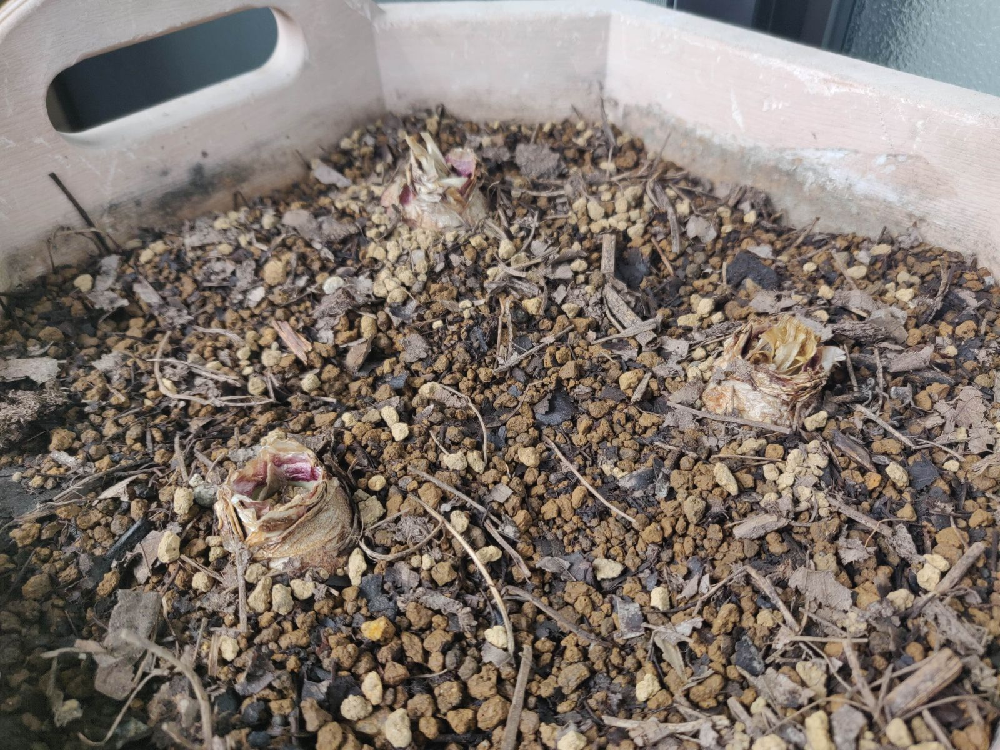

　[Hardonize](http://hardonize.info/event/2020-11-14sat-hardonize-37.html)というイベントに出演することになりました。もしよかったら現地か配信でお楽しみください。  

## 今日の様子

　昨日の日曜日に水をやりました。もう少し待ってからでもよかったかもしれませんが、土がなんとなく乾いていましたので。半年前はポットが小さかったので、ペットボトルに取り付けて使う注ぎ口を100均で買ってきて、それで世話をしていました。お茶のペットボトルが各社デザインが違い、そこからじょうろ替わりを吟味するのが面白かったです。  
　現在は鉢を大きなものに変えたため、ペットボトルだと少し水が足りないと感じます。水汲みのために、何往復かしないといけません。幸い、鉢に見合ったじょうろが家にあり、それを使っています。水のやりすぎが不安ではありますが、底からあふれるまでは注ぐことにしました。春までには結果が出るでしょう。  
　急激に寒くなりましたが、ヒヤシンスが育つなら問題ないかな、と思っている自分がいます。優先度が高くなっているのかもしれませんが、単に、外出する頻度が極端に減ったため、関心がなくなっているだけのようにも思えます。これでも最近は、毎週末なにかしらの理由で外出しています。けれども考えてみれば、出勤している時は週に5回以上は外にいて歩いているわけです。ですから、平日家にいるだけで運動量は明らかに落ちるということですね。道理で元気なわけです。
