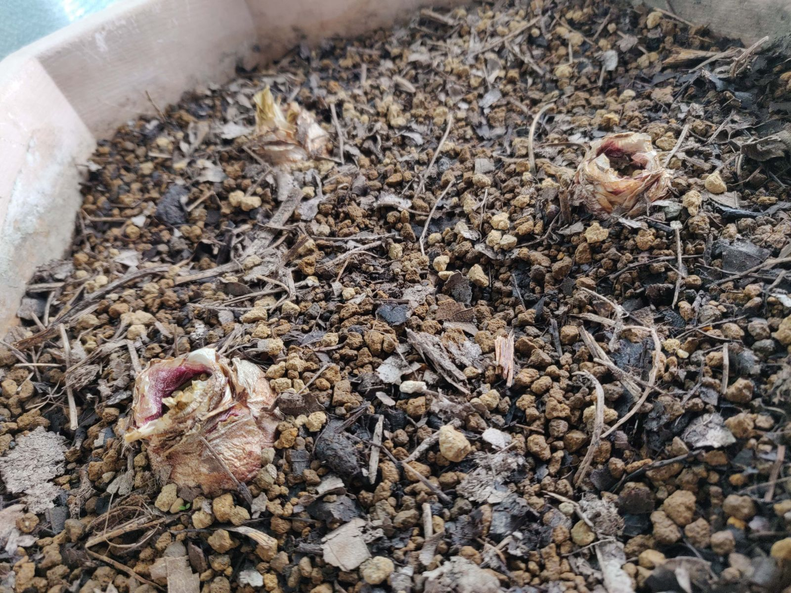

## 今日の様子

　ヒヤシンスを植えてから一週間が経ちました。大きな変化はありませんが、球根の1つから根のようなものが、地表に出ているのを見つけました。(画像左下)  
まずは根をはってくれないと始まりませんから、これがよい兆候であれば嬉しいですね。  
　水をやるタイミングについて。前回はなんとなくで決めていましたが、よくよく見ていると、赤玉土の色で判別できそうです。普段は赤茶色ですが、乾くと砂っぽいカーキ色になるみたいです。水のやりすぎは警戒したいですから、なんとかいいタイミングが察せられるようにしておきたいところです。腐葉土とは違いますね。  

　ブログの調整をやんわりと進めています。ひとまず色合いを真っ白から変えておこうか、とは思っているのですが。プラグインを挿してなんとかなる部分と、CSSを自力で書き直すべき部分があり、後者はなかなか慣れないです。見た目の問題ですから、そこまで警戒しなくてもいいんでしょうけれども。少しずつチャレンジもしていこうと思います。
