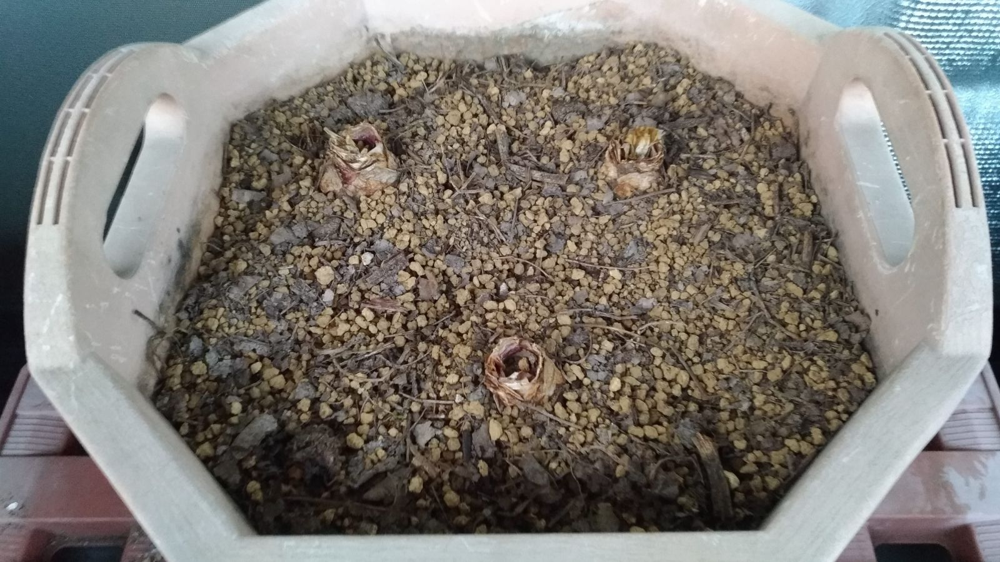

　夜、家の前を出歩いていたらアシダカグモに遭遇しました。比較的緩慢にその辺を歩いており、初のご対面に驚く僕とは対照的に、向こうはなんとも思っていないようでした。こいつが出る場合その食べ物もいるということです。心当たりは数ヶ月前からありましたので、まあ来るべきものが来たといったところでしょう。これで捕食対象が全滅してくれれば、何も言うことはないのですが。ここは森でもなんでもないですから、食べきる前に排除されるのが心配です。  
　かく言う自分も、ドアを開けて足元にアシダカグモがいた場合、あまり冷静ではいられない気がします。明日からどこを徘徊しているかチェックしておきたいところです。

## 今日の様子

　少し時間があいての水やりとなりました。球根はとくに変化はありませんでした。[前回の記事](https://hyacinth-alter095.netlify.app/201022/)で根のような、緑色の物体を見かけていたのですが、単に雑草だったようです。放っておいてもよかった気がしましたが、球根にかなり近かったため、抜いておくことにしました。  
　土を自分でブレンドしたため、水はけについて不安があったのですが、何回か水やりを実際にした様子を見ていると、そこは問題なさそうです。如雨露から水を注ぐと、速やかに土に吸い込まれて、少し経てば底から流れ出てきます。本当に大丈夫なのかが、そもそもわからないわけですけれども、ひとまずこのことは明日から忘れることにします。  
　次回は忘れることについてちょっとだけ書いてみようと思います。覚えていたら、ですけど。
