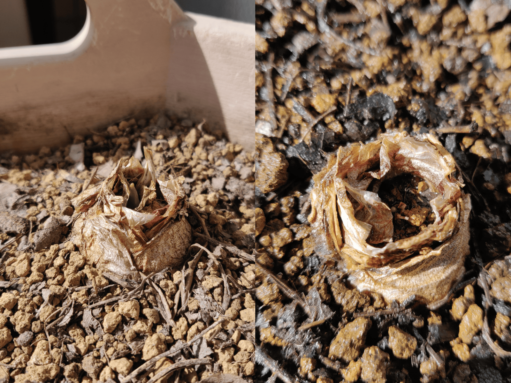

　11月になりました。更新している今日は11月4日ですが、2日にも一度水やりをしました。記事を書く時間をとれなかった間、それなりに日光が強かったようで、今朝様子を見ると、すでに土が乾いていたのです。その時いいことに気づけたので、結果的にはちょうどいい更新日となりました。

## 今日の様子

　タイトルの通り、芽が出ているのを見つけました。実は10月28日、前回の記事を書いた翌日の時点で、3つの球根のうち1つからは確認ができていました。昨日までにもう1つも芽が出ていて、逆に、最後の1つがきちんと発芽するのか、それを待っていたところでした。今朝気づいたのは、その最後の1つも何事もなく成長している、ということでした。その球根だけ、プランターの手前側に植えられているため、少しだけ日当たりに差があるのかもしれません。  
　写真の左側が最初に発芽した時のものです。芽が5ミリほど突き出しており、このまま成長すれば週末には球根の外まで飛び出してくるのかな、と予想しています。右側が今日芽をみつけた方です。ちょうど真ん中あたりにある、グリーンピースに似たつやのあるものが芽になります。勘違いだと嫌なんですが、明日以降わかることでしょう。  
　色々と手探りで進めていますので、こうして成果がはっきりとわかるのはいいものですね。最近は良く晴れて乾燥していますから、水やりを忘れないようにしたいです。いつも忘れることを恐れているような気がしますね。
